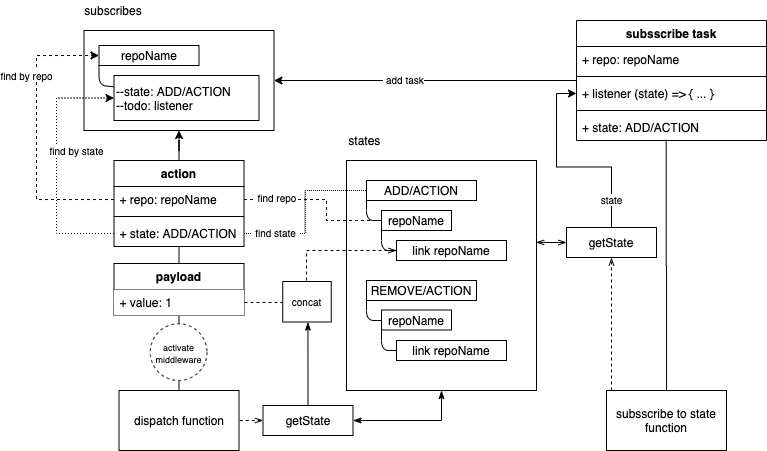

## State and store subscribe 
The subscription system is required to get the current state of the storage at the time of the update. Traditionally, the subscription pattern consists of the function of subscribing, unsubscribing and dispatcher, Biscuit adheres to this concept.

### Concept
Conceptually, the subscription system in biscuit is similar to the (vanilla) addEventListener, but there are still a few differences. 

For example, listeners are distributed among collections according to the repository name, this allows you to localize listeners and reduce the size of arrays.
Subscribers can also subscribe to the entire store and to the event separately, which makes the development process more flexible.
It is also worth noting that the subscriber is asynchronous and in addition to the callback can return a promise. 

The dispatcher function also has a number of interesting features, such as the ability to return the previous state and asynchronously process middleware.



### Creating a subscription
First you need to create a store that we will subscribe to:

```javascript
import { createStore } from "@biscuit-store/core";

const testStore = createStore({
    repo: {
        name: "test",
        initial: { value: 0 }
    },
    states: {
        addAction: "ADD/ACTION",
        removeAction: "REMOVE/ACTION",
    }
});

export const { store } = testStore;
export const { addAction, removeAction } = testStore.actions;
```
After creating a store, we have the opportunity to subscribe to its changes. Here it is worth noting that we have two subscription options: 

The first option is to subscribe to the change of the store itself, then you will receive updates when any state changes. 

```javascript
import { store } = './testStore.js';

store.subscribe((store) => {
    console.log(store);
});
```

The second option is to subscribe to a specific state. In this case, you will only listen to the state that you are subscribed to.

```javascript
import { addAction } = './testStore.js';

addAction.subscribe((store) => {
    console.log(store);
});
```
It is up to you to decide in which situation to use a particular subscription method.

In addition to getting methods from the store, you can use the biscuit API methods (composite methods).
```javascript
import { subscribeToState, subscribeToStore } from "@biscuit-store/core";
import { addAction, store } = './testStore.js';

subscribeToState(addAction, (state) => {
    console.log(state);
});

subscribeToStore(store, (state) => {
    console.log(state);
});
```
There is no difference between composite and inline methods, except for the syntax. Which option you will use is up to you.

### Async subscribe

It is also worth mentioning that the subscriber is an asynchronous function that returns a promise, which means that you can use then instead of callback.

```javascript
import { addAction, store } = './testStore.js';

addAction.subscribe().then((state) => {
    consle.log(state);
});

store.subscribe(console.log).catch((e) => {
    consle.log(e);
});
```
### Unsubscribe
Now let's look at the situation when you need to unsubscribe from a particular store or state. For these purposes, the unsubscribe mechanism is implemented.
```javascript
import { store } = './testStore.js'

const listner = store.subscribe((store) => {
    console.log(store);
});
    
listner.unsubscribe();
```
To avoid memory leaks, remember to unsubscribe before unmounting the method containing the listener.

### Dispatch

Dispatcher is a method that is used to send the updated state to the store and notify listeners of the received changes.

```javascript
import { addAction, store } = './testStore.js';

addAction.subscribe().then((state) => {
    consle.log(state); // {value: 1}
});

addAction.dispatch({value: 1});
```

The dispatch method can accept both an object directly and a callback function that will receive the current state and return the payload.

```javascript
addAction.dispatch(({ value }) => ({value: value + 1}));
```
Dispatch also returns a number of useful methods:
  - before: Works out before the change and returns the current state;
  - after: Works out after the change and returns the new state;
  - merge: Used for states transformed into the branches. Merges the state data to the main repository.

```javascript
addAction.dispatch({value: 1}).before((prevState) => {
    console.log(prevState.value); // 0
});

addAction.dispatch({value: 2}).after((currentState) => {
    console.log(currentState.value); // 2
});

branchAction.dispatch({value: 3}).merge();
// or
addAction.dispatch({value: 4}).after((currentState) => {
    console.log(currentState.value); // 2
}).merge();
```

You can also use the composite method:
```javascript
import { dispatch } from "@biscuit-store/core";
import { addAction } = './testStore.js';

dispatch(addAction, (prevState) => ({value: prevState + 1}));
```

#### Dispatch is asynchronous
You must understand that the dispatcher is an asynchronous function. 
That is, if you want to write something like this:
```javascript
action.subscribe((state) => {
	console.log(state.value);
	// 1
	// 1
	// 1
});

const arr = new Array(3).fill(1);
for (let key of arr) {
	action.dispatch((prev) => ({ value: prev.value + key }));
}
```
In the console output, each iteration you will get 1 and not a number incremented by one. This is due to the fact that the dispatcher functions at the same time throw data into the storage and we get the effect of a race.
Biscuit provides you with an option to avoid this:
```javascript
    action.subscribe((state) => {
        console.log(state.value);
		// 1
		// 2
		// 3
    });

    (async function () {
        const arr = new Array(3).fill(1);
        for (let key of arr) {
            await action.dispatch((prev) => ({ value: prev.value + key })).wait;
        }
    }());
```
The **wait** method returns a promise that will be fulfilled when the dispatcher completes all processes.

### Static description of the action
Composite methods can handle not only an action variable but also a static description.
```javascript
import { dispatch } from "@biscuit-store/core";

dispatch(
    {repo: "test", action: "ADD/ACTION"}, 
    (prevState) => ({value: prevState + 1})
);

subscribeToState(
    {repo: "test", action: "ADD/ACTION"}, 
    (state) => {
        console.log(state);
    }
);
```
Now you know a lot more about the Biscuit subscription system.

### Learn more
 - [State](./core/STATE.md)
